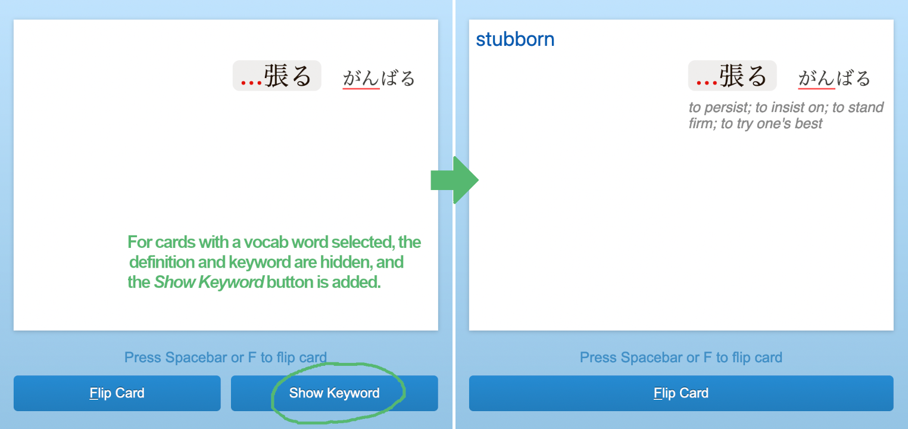

koohii vocab+

Firefox and Chrome browser extension to improve kanji review on kanji.koohii.com.

Allows you to hide the keyword and vocab definition during review in order to practice recall with the vocab word, without having to manually replace all keywords with vocab words.
Adds a button to show the keyword and vocab definition if needed before flipping the card.
For cards without vocab, the keyword is still shown.

